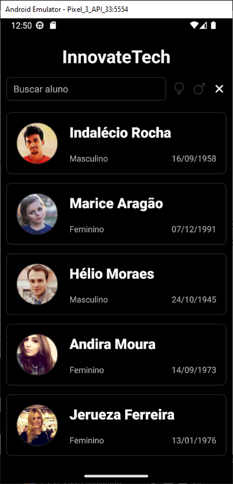
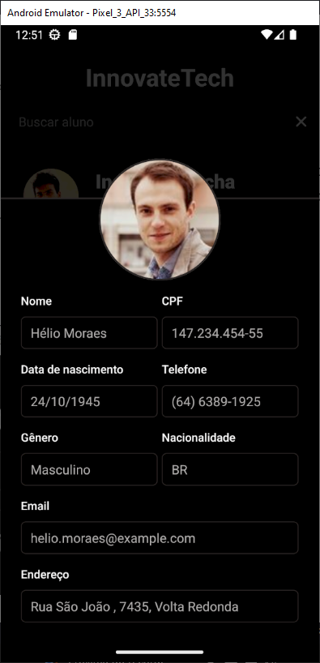

## C2S MOBILE CHALLENGE

### 🤔 Sobre
Este desafio avalia a capacidade de estruturar e tomar decisões autônomas para criar um aplicativo escalável com React Native e TypeScript, consumindo a API da randomuser para exibir informações ao usuário.

### 📘 Requisitos

- [x] Tela de carregamento com a logo da InnovateTech
- [x] Listagem dos alunos com o limite de 20 alunos por carregamento
- [x] Ao chegar no final da listagem carregar mais 20 alunos
- [x] Ao digitar um texto na barra de pesquisa filtrar os alunos pelo primeiro ou segundo nome
- [x] Ao clicar em algum dos alunos deve abrir um modal detalhando as informações desse aluno


### 📙 Requisitos extras

- [x] Adicionar um filtro por Gênero na tabela;
- [x] Após o primeiro load dos dados guardar as informações em um cache interno do celular (APENAS DA PRIMEIRA PÁGINA), se o app for aberto novamente puxar os dados do cache e não da API.
- [x] Utilizar algum gerenciador de estado na aplicação, como useContext, Redux ou qualquer outro que você queira.

### 🛠 Tecnologias/Ferramentas utilizadas

[react-native]
[typescript]
[expo]
[styled-components]
[zustand]
[async-storage]
[axios]
[eslint]


### 🚀 Como executar o projeto

```bash
# Clone o projeto
$ git clone https://github.com/MatheusGCM/c2s-mobile-challenge.git

# Entre na pasta
$ cd c2s-mobile-challenge

# Instale as dependências:
$ npm i, yarn ou pnpm i

# Execute o app:
$ npx expo start --android
```
##### ⚠ Observação:
Para garantir o funcionamento ideal, o ambiente Android é recomendado, pois todo o processo de desenvolvimento e validação foi realizado nessa plataforma. Tendo em vista que minha limitação com o sistema operacional impede a execução na versão iOS.

<br/>

### 📱 Em execução


##### ⚠ Observações:
 - Ao estudar a API, descobri que era possível filtrar os usuários brasileiros utilizando o parâmetro ``nat=br``, e optei por essa abordagem.
 - A API não garante identificadores únicos para os usuários listados. Portanto, como precaução, utilizei a biblioteca uuid para gerar identificadores únicos.
 - Para melhorar a usabilidade, utilizei ícones que representam os filtros de gênero e a opção de limpar filtros.
 - Criei um componente para exibir uma resposta apropriada quando nenhum aluno é encontrado, melhorando a interação com o usuário.

 ---

 Fico à disposição para quaisquer esclarecimentos adicionais.
 Email: matheusgcm10@outlook.com

[typescript]: https://www.typescriptlang.org/
[eslint]: https://eslint.org/
[react-native]: https://reactnative.dev/
[expo]: https://expo.dev/
[styled-components]: https://styled-components.com/
[axios]: https://axios-http.com/
[async-storage]: https://docs.expo.dev/versions/latest/sdk/async-storage/
[zustand]: https://zustand-demo.pmnd.rs/
